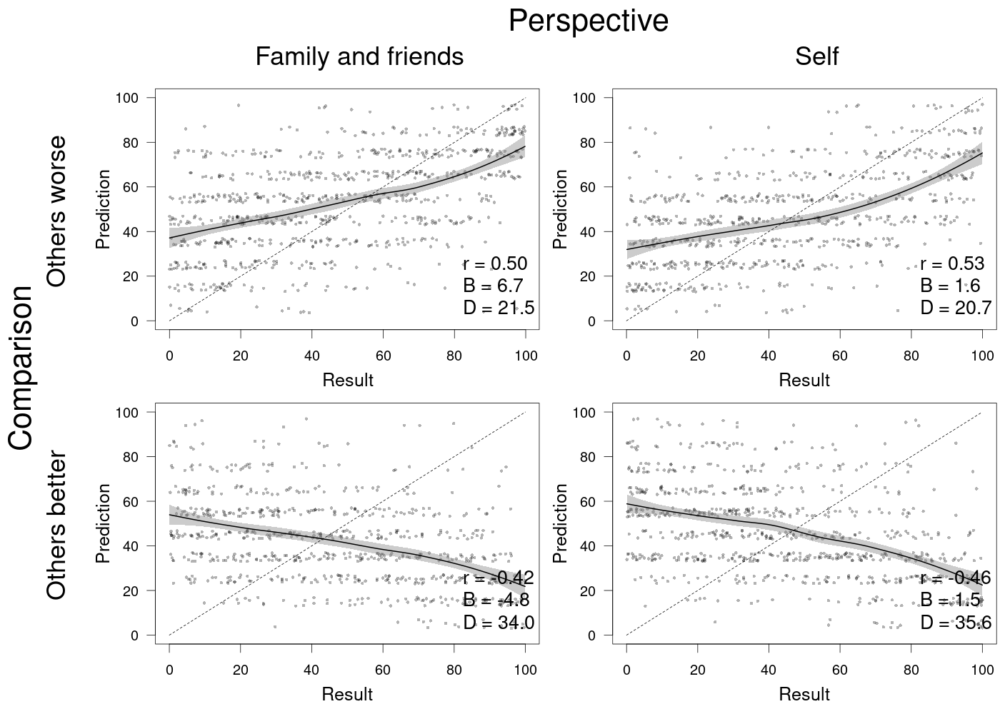

```{r setup, include=FALSE}
knitr::opts_chunk$set(echo = TRUE)
```
# Preliminary steps
Let's define our local folder as follows:
```{r}
setwd("/home/juan/Documents/GitHub/Overconfidence")
```
and let's load the raw data as follows
```{r}
load("~/Documents/GitHub/Overconfidence/d.RData")
```
Readers interested in reproducing our results might clone the repository or just download the raw data along with its corresponding scripts.

Now, let's run some preliminary ad-hoc functions for reporting results and creating graphs
```{r}
source("helper.R")
source("helper2.R")
source("graphs.R")
```

Now, before addressing the statistical analyses of our principal data set, we need to do a couple of  preliminary tasks as follows

```{r}
remain <- apply(d[,c("X12a", "X12b", "X12c", "X12d", "X13", "OSP_v_terminu")], 1, 
                function(x) all(!is.na(x)))
d <- d[remain,]
n.excluded <- 5989 - nrow(d)
n.excluded
sum(remain)
n.excluded/5989
```

# Part 1: Overconfidence, type of comparison, and perspective

Now, we will proceed with a series of regression analysis that allow us to understand the relationships between participant's self-prediction (i.e., perc.cent) and objectively measured skills as captured by the GAP test score (i.e., X13). We will begin by doing this analysis:

```{r}
m1 <- lm(I(X13-mean(d$perc[d$zkousek.OSP.vykonanych == 1])) ~ perc.cent*other.worse*other.persp, 
         data = d[d$zkousek.OSP.vykonanych == 1,])
summary(m1)
```
Our general model proved to be statistically significant, confirming our theoretical approach on the relevance of including the perspective of others as well as the comparison of the individual as predictors of overconfidence t(3080) = 4.15, p $<$ .001, b = 1.36, 95\% CI = [0.72, 2.01]. By analyzing the effects of each variable on this model, we notice that the magnitude of the relationship between participant's self-prediction and overconfidence was positive and significant (t(3080) = 3.04, p = .002, b = 0.03, 95\% CI = [0.01, 0.05]). Nonetheless, the overconfidence bias seems to be mostly related to the type of comparison (i.e., other.worse) (t(3080) = 13.84, p $<$ .001, b = 9.10, 95\% CI = [7.81, 10.38]) and the interaction between the participant’s self-prediction and his/her predictions from others' comparison (i.e., perc.cent:other.worse) (t(3080) = 30.09, p $<$ 0.001, b = 0.67, CI = [0.63, 0.72]). In fact, neither the participant's prediction from the perspective of others (t(3080) = 1.64, p = .10, b = 1.08, 95\% CI = [-0.21, 2.37]) nor its interaction with participant’s self-predictions (t(3080) = 0.67, p = .50, b = 0.015, 95\% CI = [-0.029, 0.059]) showed significant effects. The interaction between participant's prediction from the perspective of others' comparison and others' perspective revealed significant results (t(3080) = 7.62, p < .001, b = 10.013, 95% CI = [7.436, 12.590]). Figure \ref{fig1} depicts the overconfidence effect as a function of type of comparison and perspective. 

```{r pressure, echo=FALSE, fig.cap="Participant's self-prediction and GAP test scores", out.width = '80%'}

```


